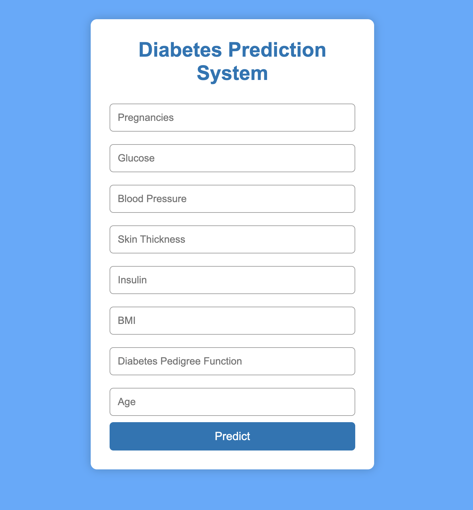
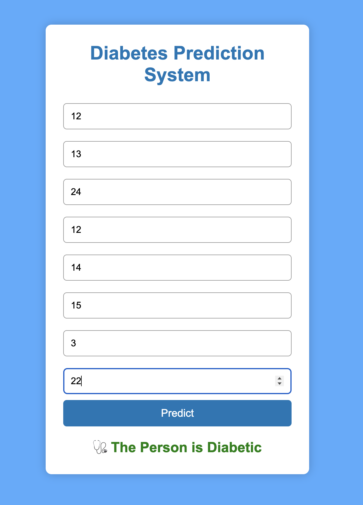

DIABETES PREDICTION SYSTEM USING MACHINE LEARNING

# Overview

The Diabetes Prediction System is a Machine Learning web application that predicts whether a person is likely to have diabetes based on medical parameters. The application uses a trained Support Vector Machine (SVM) model and provides predictions through a simple and interactive Flask web interface.

This project demonstrates the complete Machine Learning workflow, including data preprocessing, model training, model serialization, and deployment as a web application.

# Features

* Predicts diabetes using a trained Machine Learning model
* Interactive and responsive web interface
* Data preprocessing with StandardScaler
* Real-time prediction
* User-friendly design
* Lightweight Flask backend
* Easy to deploy on Render or Railway

# Tech Stack

Programming Language

* Python

Machine Learning

* Scikit-learn
* Support Vector Machine (SVM)
* StandardScaler

Web Development

* Flask
* HTML5
* CSS3

Libraries

* NumPy
* Pandas
* Pickle

# Project Structure

Diabetes-Prediction/
│
├── app.py
├── model.pkl
├── scaler.pkl
├── requirements.txt
├── README.md
│
├── templates/
│   └── index.html
│
└── static/
    └── style.css

# Dataset

The project uses the Pima Indians Diabetes Dataset, which contains medical information collected from female patients.

Input Features

* Pregnancies
* Glucose
* Blood Pressure
* Skin Thickness
* Insulin
* BMI
* Diabetes Pedigree Function
* Age

Output

* 0 → Not Diabetic
* 1 → Diabetic

⸻

# Machine Learning Workflow

1. Data Collection
2. Data Preprocessing
3. Feature Scaling using StandardScaler
4. Train-Test Split
5. Model Training using Support Vector Machine (SVM)
6. Model Evaluation
7. Save Model using Pickle
8. Deploy using Flask

# Installation

Clone the Repository

git clone https://github.com/your-username/Diabetes-Prediction.git

Navigate to the Project

cd Diabetes-Prediction

Install Dependencies

pip install -r requirements.txt

Run the Application

python app.py

Open your browser and visit:

http://127.0.0.1:5000

# How It Works

1. Enter patient details.
2. Click the Predict button.
3. Input values are scaled using the saved StandardScaler.
4. The trained SVM model predicts the result.
5. The prediction is displayed instantly.

# Screenshots

## Screenshots

### Home Page

### Prediction Page

### Result Page

#  Future Improvements

* User authentication
* Patient history storage
* Database integration
* Email prediction reports
* Improved UI with Bootstrap
* Charts and analytics dashboard
* Docker deployment
* Cloud deployment with CI/CD

# Author

Rakesh Posani

Final Year B.Tech Student
Vardhaman College of Engineering

# Skills

* Python
* Machine Learning
* Flask
* Data Analytics
* SQL
* HTML & CSS

# Acknowledgements

* Scikit-learn
* Flask
* NumPy
* Pandas
* Pima Indians Diabetes Dataset

